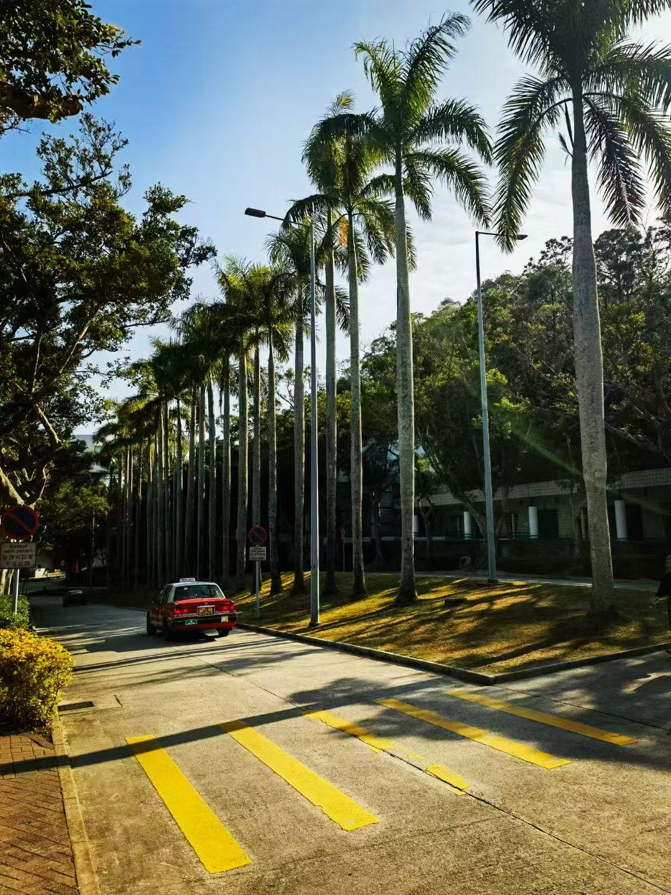
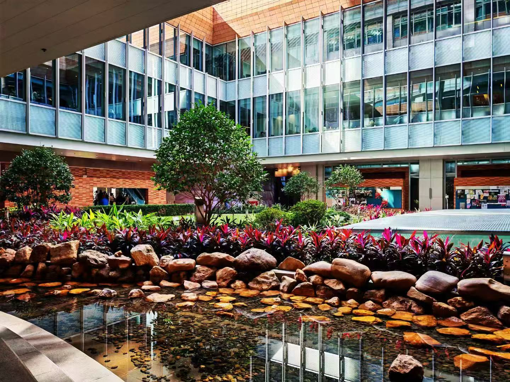
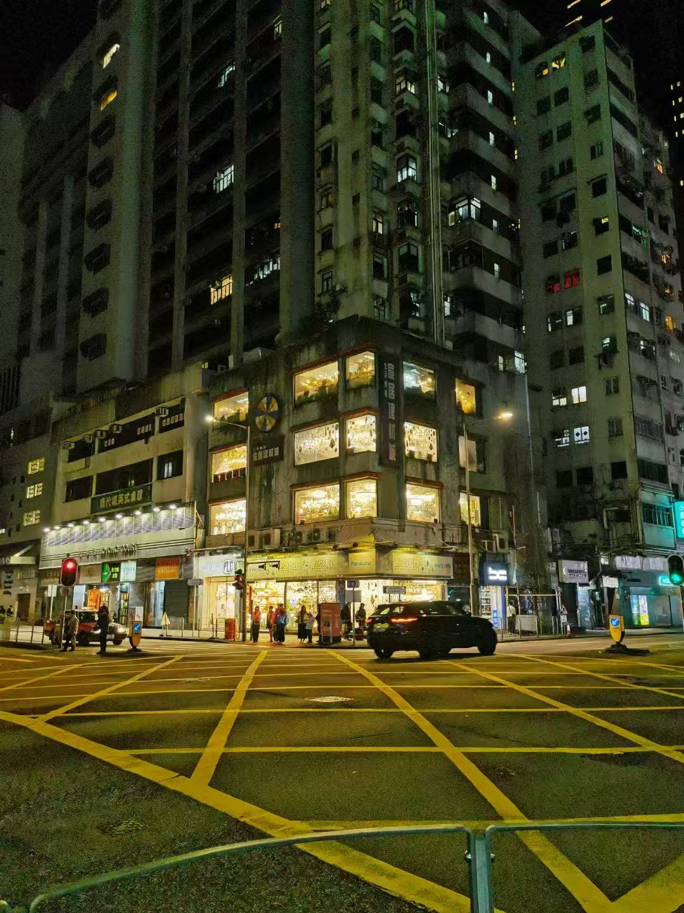
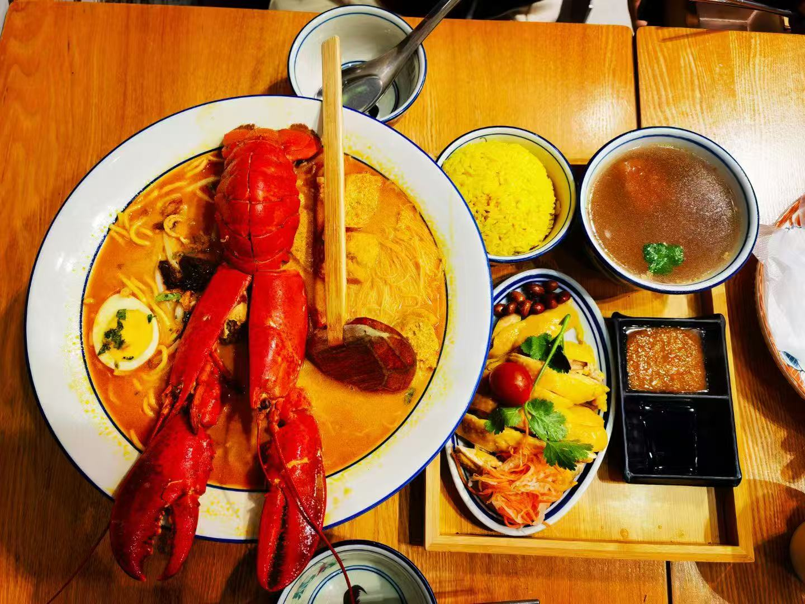
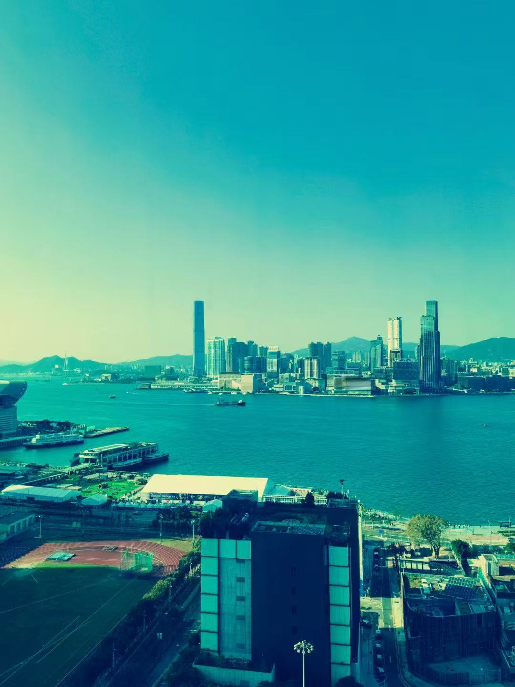
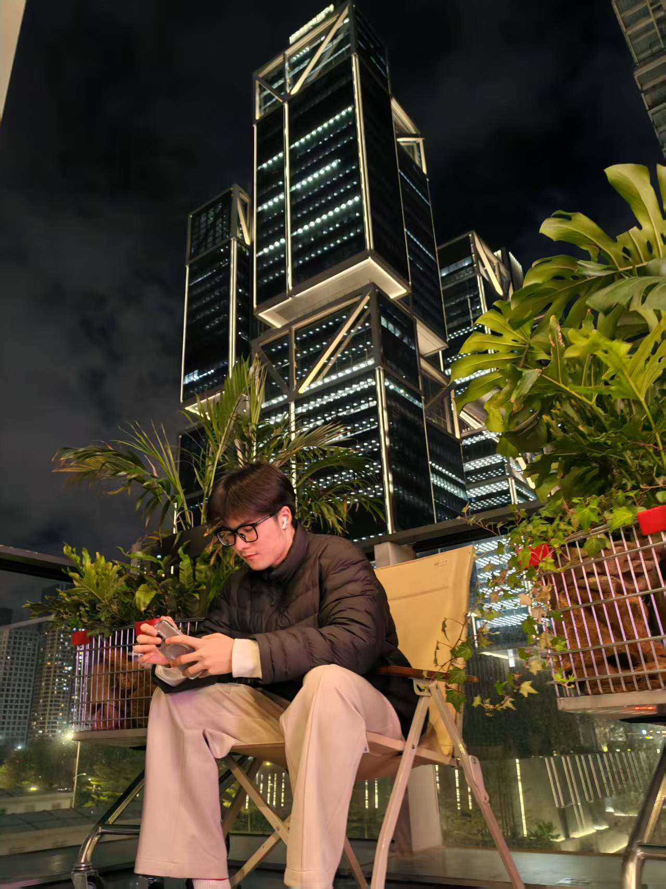
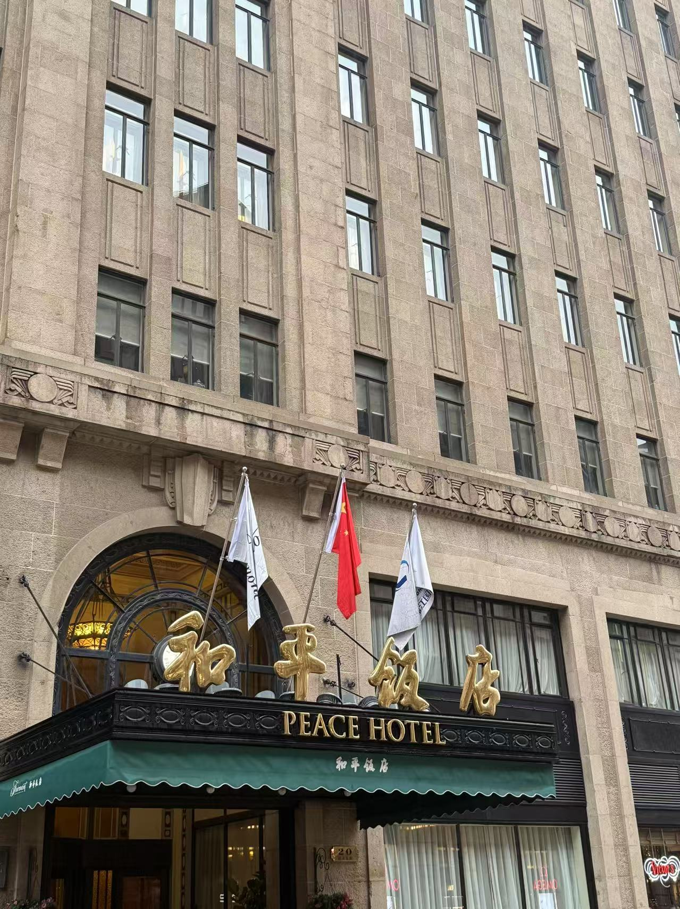

Hong Kong, a vibrant metropolis known for its towering skyscrapers, bustling markets, and rich cultural heritage, is a city that never sleeps. Nestled on the southern coast of China, Hong Kong offers a unique blend of Eastern and Western influences, making it a melting pot of cultures. Visitors can explore the bustling streets of Mong Kok, take a tram ride to the iconic Victoria Peak for breathtaking views, or enjoy a serene moment at the tranquil Nan Lian Garden. The city's culinary scene is equally diverse, with everything from traditional dim sum to international gourmet cuisine. Whether you're shopping in the luxury boutiques of Central or wandering through the historic temples of Sheung Wan, Hong Kong promises an unforgettable experience.
I visited a lot of places in HongKong:
HKUST:

HKU:

The Night in Hong Kong:

The Food:

The Sea:

And I also passed by the ShenZhen city where I went to the DJI building intentionally:

Additionally, ShangHai is great:

